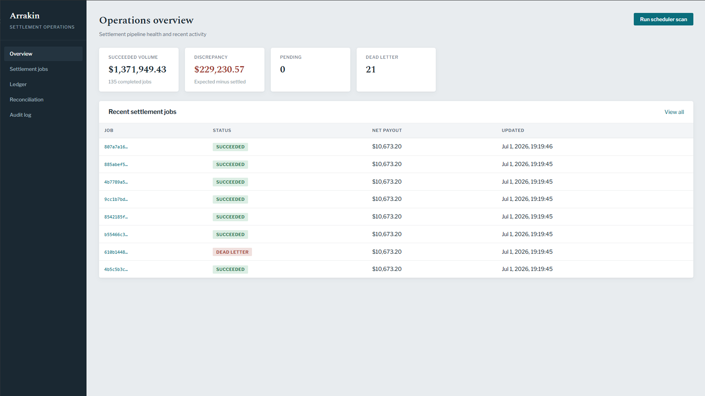
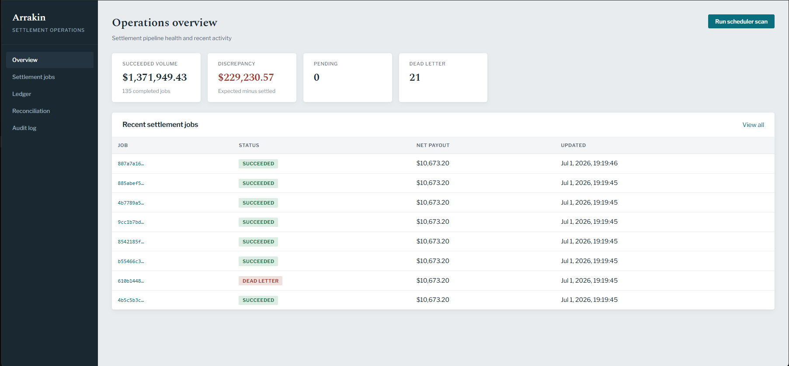
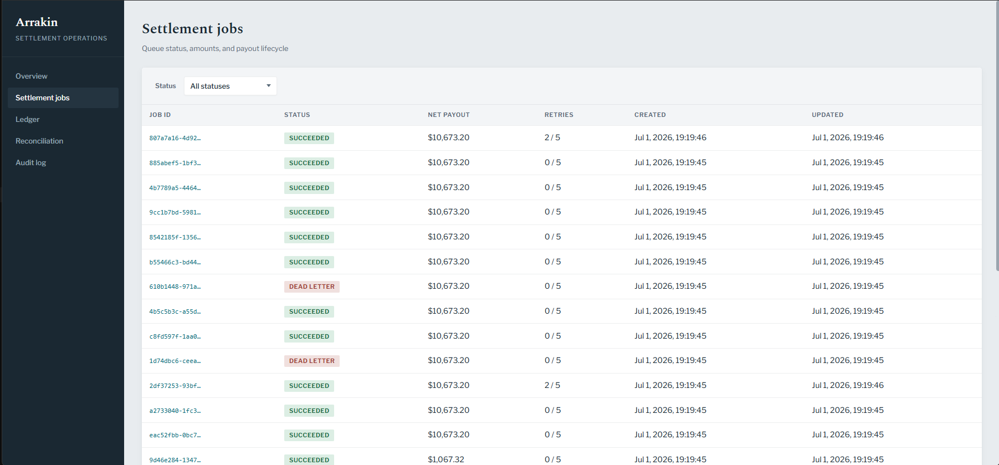
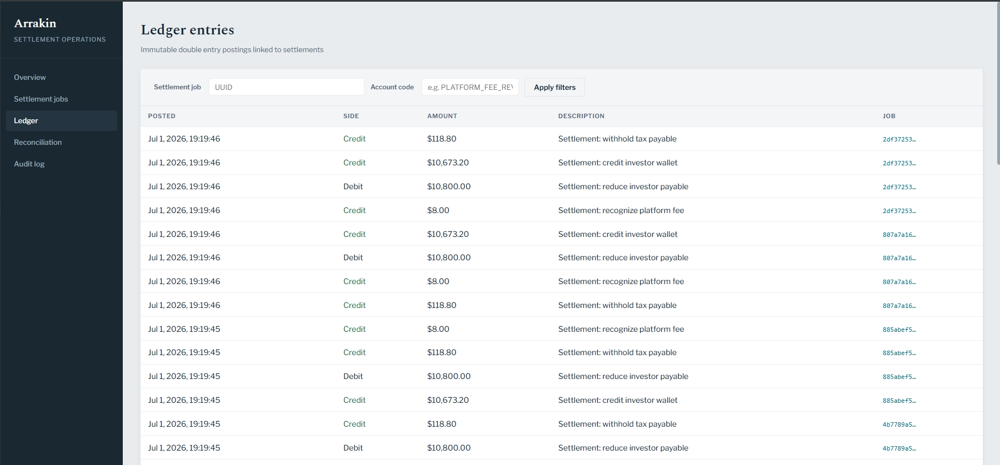
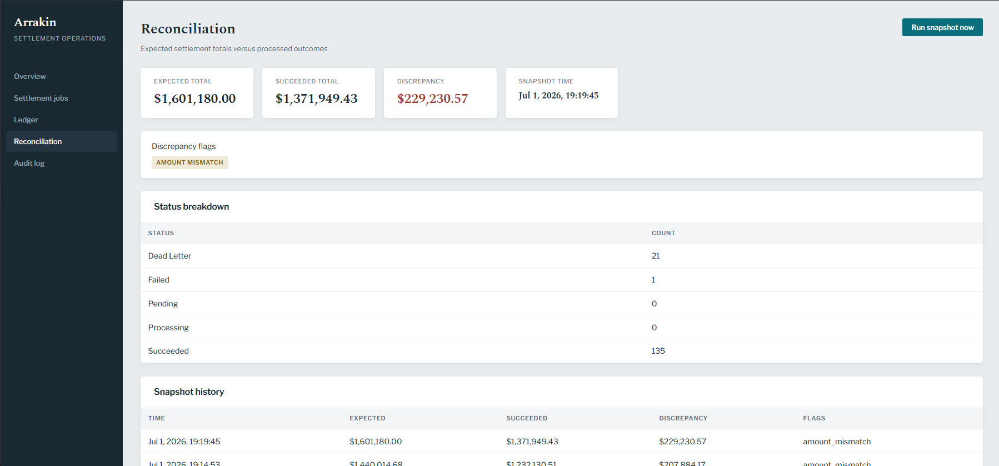
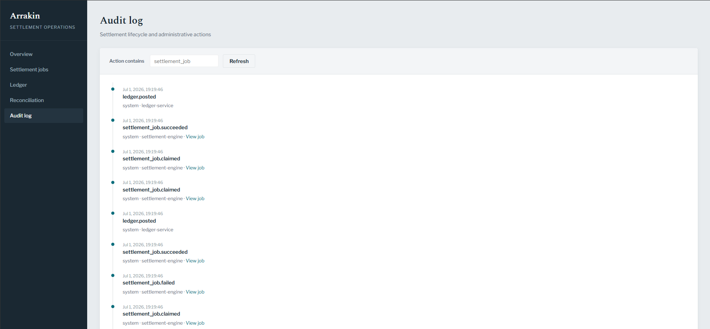
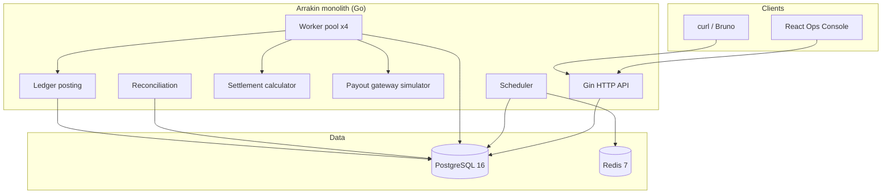
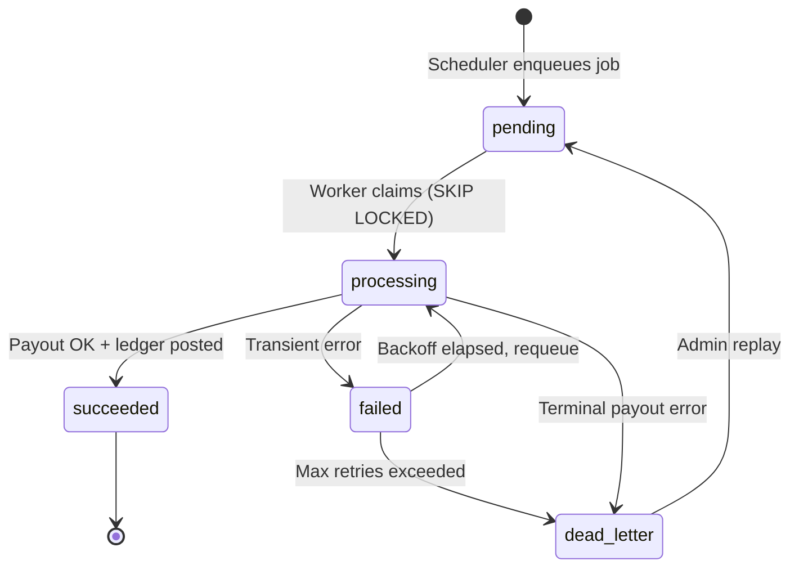
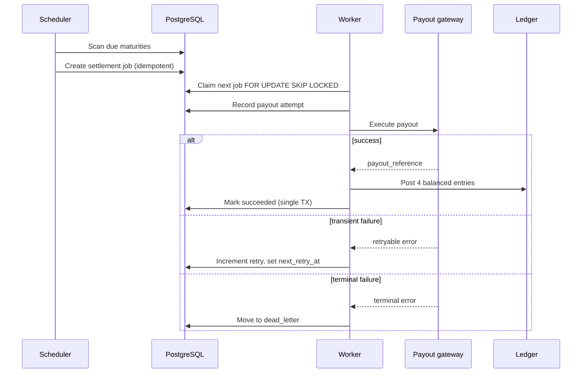
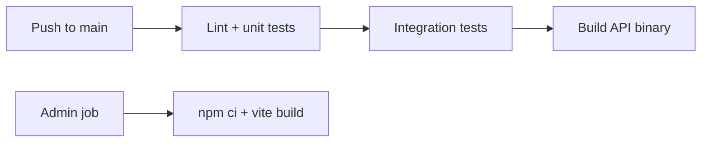

<p align="center">
  
</p>

<h1 align="center">Arrakin</h1>

<p align="center">
  <strong>Exact settlement. Immutable ledger. Operational trust.</strong>
</p>

<p align="center">
  <a href="#what-is-arrakin">Overview</a> &nbsp;|&nbsp;
  <a href="#operations-console">Console</a> &nbsp;|&nbsp;
  <a href="#by-the-numbers">Metrics</a> &nbsp;|&nbsp;
  <a href="#getting-started">Quickstart</a> &nbsp;|&nbsp;
  <a href="DEMO.md">Demo Guide</a> &nbsp;|&nbsp;
  <a href="http://localhost:8080/swagger/index.html">OpenAPI</a>
</p>

<p align="center">
  
  
  
  
  
</p>

<hr/>

When a debt investment matures, someone must answer a hard question with money on the line: **how much is owed, to whom, and has it been paid exactly once?**

Most demo backends stop at CRUD. Production finance cannot. A duplicate payout is not a bug report. It is a reconciliation crisis. A missing ledger line is not a log gap. It is an audit failure. Arrakin exists in that gap between tutorial apps and real settlement infrastructure.

Arrakin is a **reliability first settlement engine** for matured investments. It detects due maturities, calculates principal, return, fees, and withholding in **integer cents**, enqueues payout jobs, processes them with concurrent workers under row level locking, writes **append only double entry ledger** records in the same database transaction as payout completion, retries transient failures with backoff, routes terminal failures to **dead letter**, and gives operators reconciliation and audit visibility through a typed REST API and internal console.

No duplicate completion under concurrency. No floating point money paths. No silent state changes.

<hr/>

## Table of Contents

1. [Preview](#preview)
2. [What is Arrakin?](#what-is-arrakin)
3. [The Problem](#the-problem)
4. [How Settlement Works](#how-settlement-works)
5. [Operations Console](#operations-console)
6. [By the Numbers](#by-the-numbers)
7. [Technology Stack](#technology-stack)
8. [Architecture](#architecture)
9. [Settlement Lifecycle](#settlement-lifecycle)
10. [Scheduler and Worker Flow](#scheduler-and-worker-flow)
11. [API Surface](#api-surface)
12. [Getting Started](#getting-started)
13. [Demo and Verification](#demo-and-verification)
14. [CI Pipeline](#ci-pipeline)
15. [Repository Structure](#repository-structure)
16. [Documentation](#documentation)
17. [License](#license)

<hr/>

## Preview

<p align="center">
  
</p>

<hr/>

## What is Arrakin?

Arrakin is backend financial infrastructure for a **debt investment platform** at the moment of maturity.

| Stage | What happens |
|-------|----------------|
| **Detect** | Scheduler scans due `maturity_schedules` and enqueues settlement jobs |
| **Calculate** | Engine computes gross return, platform fee, withholding tax, net payout |
| **Process** | Worker pool claims jobs with `FOR UPDATE SKIP LOCKED`, simulates payout gateway |
| **Record** | Four balanced ledger entries posted atomically with successful payout |
| **Recover** | Exponential backoff on transient errors; dead letter on terminal failure |
| **Verify** | Reconciliation snapshots compare expected vs settled totals |
| **Observe** | Audit events and admin API for every meaningful state transition |

The included **React operations console** is a client of the same API an SRE or finance ops team would use. The product is the engine, not a landing page.

<hr/>

## The Problem

Debt platforms must settle matured positions **exactly once** while remaining auditable under failure, retries, and concurrent workers.

| Failure mode | Arrakin response |
|--------------|------------------|
| Duplicate scheduler tick | Unique constraint + idempotent enqueue key per maturity |
| Two workers claim same job | `SKIP LOCKED` + transactional status transitions |
| Duplicate payout completion | Unique `payout_reference` per completed payout |
| Duplicate admin POST | `Idempotency-Key` header with stored response replay |
| Transient gateway error | Retry with backoff, capped attempts |
| Terminal gateway error | Dead letter until explicit admin replay |
| Amount drift | Reconciliation flags: `amount_mismatch`, `missing_ledger`, `orphan_ledger`, `stale_pending` |

<hr/>

## How Settlement Works

<p align="center">
  
</p>

All amounts are stored as **`BIGINT` USD cents**. The calculator uses basis points for fee and tax. Every successful job produces **four ledger lines** (debits and credits balance). Processing runs inside a **single Postgres transaction** spanning job status, payout attempt row, and ledger insert.

Demo seed (`make seed`) ships five investments with deliberate outcomes:

| Investment | Simulation profile | Expected result |
|------------|-------------------|-----------------|
| INV DEMO 001 | `success` | Succeeds on first attempt |
| INV DEMO 002 | `transient_then_success` | Retries, then succeeds |
| INV DEMO 003 | `terminal_failure` | Ends in dead letter |
| INV DEMO 004 | `success` | Additional succeeded volume |
| INV DEMO 005 | *(none)* | Production style success path |

<hr/>

## Operations Console

<p align="center">
  <em>Internal ops UI wired to the same REST API. Built with React, TypeScript, and typed API clients.</em>
</p>

<table>
  <tr>
    <th align="center">Operations Overview</th>
    <th align="center">Settlement Jobs</th>
  </tr>
  <tr>
    <td align="center">
      
    </td>
    <td align="center">
      
    </td>
  </tr>
  <tr>
    <th align="center">Ledger Entries</th>
    <th align="center">Reconciliation</th>
  </tr>
  <tr>
    <td align="center">
      
    </td>
    <td align="center">
      
    </td>
  </tr>
  <tr>
    <th align="center" colspan="2">Audit Log</th>
  </tr>
  <tr>
    <td align="center" colspan="2">
      
    </td>
  </tr>
</table>

| Console route | Purpose |
|---------------|---------|
| `/` | Pipeline health, reconciliation cards, scheduler trigger |
| `/jobs` | Filterable job queue with status and pagination |
| `/jobs/:id` | Amounts, payout attempts, replay and requeue |
| `/ledger` | Entry list with job and account filters |
| `/reconciliation` | Latest snapshot, run snapshot, history |
| `/audit` | Lifecycle and admin action timeline |

<hr/>

## By the Numbers

<p align="center">
  
  
</p>

| Metric | Value | Context |
|--------|------:|---------|
| Concurrent workers | **4** | Configurable `WORKER_COUNT`; tested with parallel job completion |
| Jobs per concurrency test | **5** | Zero duplicate ledger postings under contention |
| Ledger lines per settlement | **4** | Balanced double entry per succeeded job |
| Max payout retries | **5** | Exponential backoff before dead letter |
| Demo investments seeded | **5** | Success, retry, and terminal failure paths |
| Integration test scenarios | **15+** | Scheduler, ledger, retry, dead letter, HTTP idempotency |
| HTTP API version | **v1** | Settlement, ledger, reconciliation, audit, admin |
| Money representation | **BIGINT cents** | No floating point in settlement paths |
| Idempotency layers | **3** | HTTP keys, maturity enqueue keys, payout reference |

**Resume style impact (backend):**

| Accomplishment (X) | Measurement (Y) | Method (Z) |
|--------------------|-----------------|--------------|
| Go settlement engine | **4** workers, **5** parallel jobs, **0** duplicate completions | Postgres `SKIP LOCKED`, transactional sqlc |
| REST ops API + CI | **15+** integration tests, automated pipeline on every push | Gin, idempotency store, GitHub Actions |

<hr/>

## Technology Stack

<table>
  <tr>
    <th align="center">Layer</th>
    <th align="center">Choices</th>
    <th align="center">Role</th>
  </tr>
  <tr>
    <td align="center"><strong>Language</strong></td>
    <td align="center">Go 1.24+</td>
    <td align="center">Single binary: API + scheduler + workers</td>
  </tr>
  <tr>
    <td align="center"><strong>HTTP</strong></td>
    <td align="center">Gin, OpenAPI (swag)</td>
    <td align="center">Versioned REST, Swagger UI at <code>/swagger</code></td>
  </tr>
  <tr>
    <td align="center"><strong>Database</strong></td>
    <td align="center">PostgreSQL 16</td>
    <td align="center">Queue, ledger, idempotency, audit (source of truth)</td>
  </tr>
  <tr>
    <td align="center"><strong>Cache / lock</strong></td>
    <td align="center">Redis 7</td>
    <td align="center">Scheduler leader lock, health checks</td>
  </tr>
  <tr>
    <td align="center"><strong>Data access</strong></td>
    <td align="center">sqlc, golang migrate</td>
    <td align="center">Typed SQL, schema migrations</td>
  </tr>
  <tr>
    <td align="center"><strong>Observability</strong></td>
    <td align="center">log/slog JSON</td>
    <td align="center">Structured logs with <code>request_id</code>, <code>job_id</code></td>
  </tr>
  <tr>
    <td align="center"><strong>Admin UI</strong></td>
    <td align="center">React, TypeScript, Vite</td>
    <td align="center">Ops console consuming <code>/api/v1</code></td>
  </tr>
  <tr>
    <td align="center"><strong>Testing</strong></td>
    <td align="center">go test, Docker Compose</td>
    <td align="center">Unit + tagged integration suite</td>
  </tr>
  <tr>
    <td align="center"><strong>API tooling</strong></td>
    <td align="center">Bruno collection</td>
    <td align="center">Runnable requests under <code>api/bruno/</code></td>
  </tr>
</table>

<hr/>

## Architecture



| Design choice | Rationale |
|---------------|-----------|
| Postgres backed queue | ACID with ledger; no queue drift |
| Monolith first | Faster local dev; modules extractable later |
| Integer cents | Eliminates float rounding in money paths |
| Append only ledger | Corrections are new entries, not updates |
| Simulated payout gateway | Interface ready for ACH/wire adapter |

<hr/>

## Settlement Lifecycle



| Status | Meaning |
|--------|---------|
| `pending` | Job created, awaiting worker |
| `processing` | Worker holds lease |
| `succeeded` | Payout complete, ledger written |
| `failed` | Retry scheduled |
| `dead_letter` | Requires operator intervention |

<hr/>

## Scheduler and Worker Flow



<hr/>

## API Surface

Base URL: `http://localhost:8080/api/v1`

| Method | Path | Description |
|--------|------|-------------|
| `GET` | `/settlement-jobs` | List jobs (status, investment, cursor) |
| `GET` | `/settlement-jobs/{id}` | Job detail |
| `GET` | `/settlement-jobs/{id}/attempts` | Payout attempt history |
| `POST` | `/settlement-jobs/{id}/replay` | Dead letter → pending |
| `POST` | `/settlement-jobs/{id}/requeue` | Failed → pending |
| `GET` | `/ledger/entries` | Ledger lines with filters |
| `GET` | `/ledger/accounts` | Account catalog |
| `GET` | `/reconciliation/latest` | Latest snapshot |
| `GET` | `/reconciliation/snapshots` | Snapshot history |
| `POST` | `/reconciliation/run` | On demand snapshot |
| `GET` | `/audit/events` | Audit timeline |
| `POST` | `/admin/scheduler/tick` | Manual maturity scan |

Health: `GET /healthz`, `GET /readyz` · Docs: `GET /swagger/index.html`

Mutating `POST` routes accept `Idempotency-Key`. Admin routes accept `X-API-Key` (bypassed in `APP_ENV=development`).

<hr/>

## Getting Started

### Prerequisites

| Tool | Version |
|------|---------|
| Go | 1.24+ |
| Docker + Compose | latest |
| golang migrate | CLI |
| sqlc | CLI (after schema changes) |
| Node.js | 18+ (admin UI only) |

### Backend (under 2 minutes)

```bash
cp .env.example .env
make docker-up
make migrate-up
make seed
make run
```

Verify:

```bash
curl -s http://localhost:8080/healthz | jq .
curl -s http://localhost:8080/readyz | jq .
```

Server listens on **port 8080**.

### Admin console (second terminal)

```bash
cd web/admin
cp .env.example .env
npm install
npm run dev
```

Open **http://localhost:5173** · API proxied to `:8080`

### One command demo

```bash
make demo
```

Bootstraps Docker, migrates, seeds, starts API, runs curl walkthrough. See [DEMO.md](./DEMO.md) for the full narrative.

<hr/>

## Demo and Verification

| Command | What it does |
|---------|--------------|
| `make test` | Unit tests (no database required) |
| `make test-integration` | 15+ Postgres integration scenarios |
| `make verify` | Unit + integration + admin production build |
| `make demo` | End to end API demonstration |
| `make admin-build` | Typecheck and bundle admin UI |
| `make swagger` | Regenerate OpenAPI from annotations |

**Suggested first demo path**

1. `make seed` then `make run`
2. `POST /api/v1/admin/scheduler/tick` with an idempotency key
3. Filter jobs: succeeded vs dead letter
4. Open job detail → payout attempts
5. `POST /reconciliation/run` → inspect discrepancy flags
6. Replay dead letter job → observe audit log

Import **`api/bruno/`** into [Bruno](https://www.usebruno.com/) for a clickable collection.

<hr/>

## CI Pipeline



GitHub Actions (`.github/workflows/ci.yml`):

| Job | Steps |
|-----|-------|
| **backend** | Postgres 16 + Redis 7 services → migrate → unit tests → integration tests → `make build` |
| **admin** | `npm ci` → `make admin-build` |

<hr/>

## Repository Structure

```
cmd/arrakin/              Application entrypoint
internal/
  api/                    Gin routes, handlers, DTOs
  scheduler/              Maturity scan and enqueue
  worker/                 Job processor and pool
  settlement/             Calculator, payout gateway, retry
  ledger/                 Double entry posting
  reconciliation/         Snapshot builder
  audit/                  Event publisher
  integration/            End to end flow tests
  store/                  sqlc repositories
web/admin/                React operations console
api/bruno/                API request collection
migrations/               SQL schema history
seeds/                    Demo investors and investments
specs/                    Engineering specification
docs/                     OpenAPI + production notes
scripts/demo.sh           Automated demo script
```

<hr/>

## Documentation

| Document | Description |
|----------|-------------|
| [DEMO.md](./DEMO.md) | Step by step demo walkthrough |
| [docs/PRODUCTION.md](./docs/PRODUCTION.md) | Locking, idempotency, audit, deferred items |
| [specs/implementation-spec.md](./specs/implementation-spec.md) | Full technical specification |
| [web/admin/README.md](./web/admin/README.md) | Admin UI setup |

<hr/>

## License

See [LICENSE](./LICENSE).

<hr/>

<p align="center">
  <sub>Built for engineers who care what happens to money after the HTTP response returns.</sub>
</p>
