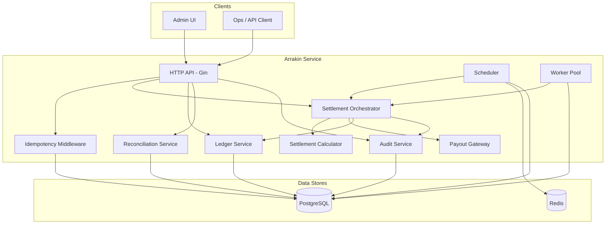
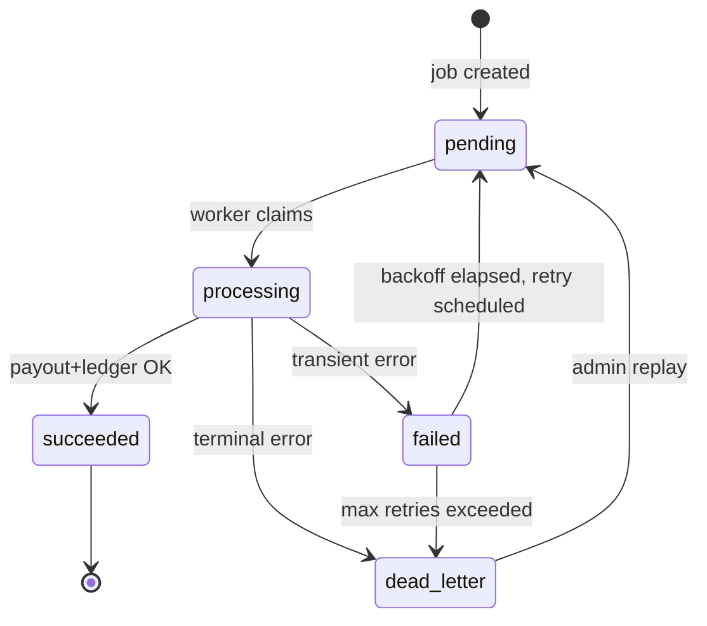

# Arrakin — Implementation Specification

**Version:** 0.1  
**Status:** Draft — pre-implementation  
**Audience:** Backend engineers, operators, reviewers

---

## 1. Problem Statement

Debt investment platforms must settle matured investments accurately and exactly once: compute what is owed, initiate payouts, record immutable financial events, and remain auditable under failure and concurrency.

Arrakin is a **single-service Go backend** that:

1. Detects investments reaching maturity.
2. Calculates settlement amounts (principal, returns, fees, taxes).
3. Enqueues and processes payout jobs concurrently.
4. Prevents duplicate settlements and duplicate payout completion.
5. Writes immutable double-entry ledger records.
6. Retries transient failures with backoff; routes terminal failures to dead-letter.
7. Exposes reconciliation and admin visibility for operational trust.

The system must read as **financial infrastructure**, not a tutorial CRUD app.

---

## 2. Functional Requirements

### 2.1 Maturity & Scheduling

| ID | Requirement |
|----|-------------|
| FR-01 | Scheduler scans `maturity_schedules` for records where `matures_at <= now()` and `status = 'pending'`. |
| FR-02 | Scheduler runs on a configurable interval (default **30s**). |
| FR-03 | Due maturities produce at most **one** active `settlement_job` per maturity (enforced by DB unique constraint). |
| FR-04 | Manual admin trigger may force settlement for a specific investment/maturity (demo + ops). |
| FR-05 | Re-running scheduler or manual trigger for an already-settled maturity is a **no-op** (idempotent). |

### 2.2 Settlement Calculation

| ID | Requirement |
|----|-------------|
| FR-10 | Calculator computes: `gross_return`, `platform_fee`, `withholding_tax`, `net_payout`. |
| FR-11 | Formula (v1): simple fixed annual rate prorated by term days on principal. |
| FR-12 | Fee = configurable bps on gross return; tax = configurable bps on (gross_return − fee). |
| FR-13 | All amounts in **USD cents** (`BIGINT`); no floating point in money paths. |
| FR-14 | Calculation output is persisted on the job before payout attempt. |

### 2.3 Job Queue & Workers

| ID | Requirement |
|----|-------------|
| FR-20 | Workers claim jobs via `SELECT … FOR UPDATE SKIP LOCKED`. |
| FR-21 | Configurable worker pool size (default **4**). |
| FR-22 | Each job processing attempt runs inside a **single DB transaction** covering status, attempt record, payout side-effect, and ledger writes. |
| FR-23 | Payout execution goes through a **PayoutGateway** interface (simulated in v1). |
| FR-24 | Stale `processing` jobs (worker crash) are recoverable via lease timeout reaper (default **5 min**). |

### 2.4 Idempotency & Ledger

| ID | Requirement |
|----|-------------|
| FR-30 | HTTP mutating endpoints accept `Idempotency-Key` header; duplicate requests return the original response. |
| FR-31 | Each successful settlement produces a balanced set of ledger entries linked to `settlement_job_id`. |
| FR-32 | Ledger entries are **append-only**; no UPDATE/DELETE on `ledger_entries`. |
| FR-33 | Unique `payout_reference` per completed payout prevents duplicate completion. |

### 2.5 Retry & Dead-Letter

| ID | Requirement |
|----|-------------|
| FR-40 | Transient payout failures increment `retry_count`, set `next_retry_at` via exponential backoff. |
| FR-41 | Max retries (default **5**) before transition to `dead_letter`. |
| FR-42 | Dead-letter jobs require explicit admin replay to re-enter the queue. |
| FR-43 | Each attempt is recorded in `payout_attempts` with error classification. |

### 2.6 Reconciliation & Audit

| ID | Requirement |
|----|-------------|
| FR-50 | Reconciliation compares expected settlement totals vs processed totals by status. |
| FR-51 | Discrepancies are surfaced with counts and amount deltas. |
| FR-52 | Snapshots may be created on-demand or by a background reconciler (default **5 min**). |
| FR-53 | State transitions and admin actions append to `audit_events`. |

### 2.7 Admin & Demo

| ID | Requirement |
|----|-------------|
| FR-60 | Seed data includes: 1 clean success, 1 retry-then-success, 1 dead-letter path. |
| FR-61 | Admin UI lists jobs by status, shows attempt history, ledger lines, reconciliation summary. |
| FR-62 | Demo re-run of settlement trigger proves idempotency (no duplicate ledger/payout). |

---

## 3. Non-Functional Requirements

| ID | Category | Requirement |
|----|----------|-------------|
| NFR-01 | Correctness | No duplicate payout completion under concurrent workers or repeated triggers. |
| NFR-02 | Durability | Postgres is source of truth; committed ledger entries survive restarts. |
| NFR-03 | Availability | Service degrades gracefully if Redis unavailable (scheduler lock falls back to DB advisory lock only). |
| NFR-04 | Performance | Handle ≥100 concurrent pending jobs on laptop Docker stack without correctness regression. |
| NFR-05 | Observability | Structured JSON logs; correlation via `request_id` / `job_id`. |
| NFR-06 | Security | Admin endpoints require `X-API-Key` outside `APP_ENV=development`. |
| NFR-07 | Testability | Integration tests run against Dockerized Postgres + Redis. |
| NFR-08 | Maintainability | sqlc for queries; golang-migrate for schema; module boundaries enforce dependency direction. |
| NFR-09 | Auditability | All job status changes emit audit events with actor and payload. |
| NFR-10 | Portability | `docker compose up` provides full local stack. |

---

## 4. Architecture

### 4.1 Style

- **Monolith** with clear internal modules; extractable later.
- **Postgres-primary**: queue, ledger, idempotency, audit.
- **Redis-secondary**: scheduler leader lock, optional hot dedupe cache.
- **Single binary** runs API + scheduler + worker pool (configurable roles via env for future split).

### 4.2 Component Diagram



### 4.3 Settlement Flow (Happy Path)

```mermaid
sequenceDiagram
    participant S as Scheduler
    participant O as Orchestrator
    participant C as Calculator
    participant DB as PostgreSQL
    participant W as Worker
    participant P as PayoutGateway
    participant L as Ledger

    S->>DB: Find due maturities (pending)
    S->>O: Enqueue settlement job
    O->>C: Compute amounts
    O->>DB: INSERT settlement_job (pending)
    W->>DB: Claim job (SKIP LOCKED)
    W->>DB: BEGIN; INSERT payout_attempt
    W->>P: Execute payout
    P-->>W: success + payout_reference
    W->>L: Post double-entry lines
    W->>DB: UPDATE job succeeded; COMMIT
    W->>DB: INSERT audit_event
```

### 4.4 Runtime Topology (Docker Compose)

| Service | Role |
|---------|------|
| `postgres` | Primary datastore |
| `redis` | Scheduler lock / dedupe cache |
| `arrakin` | API + scheduler + workers |
| `admin` | Vite static dev server (phase 8) |

---

## 5. Package / Module Boundaries

```
github.com/vamshiganesh/arrakin/
├── cmd/
│   └── arrakin/              # main: wire config, start HTTP + background loops
├── internal/
│   ├── config/               # env parsing, defaults
│   ├── platform/
│   │   ├── db/               # pgx pool, transactions
│   │   ├── redis/            # client wrapper
│   │   ├── logging/          # slog JSON setup
│   │   ├── metrics/          # Prometheus handlers
│   │   └── httpx/            # middleware: request_id, api_key, recovery
│   ├── domain/               # pure types, enums, money helpers (no I/O)
│   │   ├── investment/
│   │   ├── settlement/
│   │   ├── ledger/
│   │   └── audit/
│   ├── store/                # sqlc-generated + repository adapters
│   ├── scheduler/            # maturity scan loop
│   ├── worker/               # pool, claim, reaper
│   ├── settlement/
│   │   ├── calculator/       # amount computation
│   │   ├── orchestrator/     # enqueue + process pipeline
│   │   └── payout/           # PayoutGateway + simulator
│   ├── ledger/               # posting rules, balance validation
│   ├── reconciliation/       # snapshot builder, diff logic
│   ├── idempotency/          # key store + middleware
│   ├── audit/                # event writer
│   └── api/
│       ├── router.go
│       ├── handlers/
│       └── dto/              # request/response mapping
├── migrations/               # golang-migrate SQL files
├── sql/
│   └── queries/              # sqlc input
├── seeds/                    # demo SQL or Go seeder
├── api/                      # Bruno or OpenAPI export
├── web/admin/                # React/Vite (phase 8)
├── specs/                    # this folder
├── docker-compose.yml
├── Makefile
└── README.md
```

### Dependency Rules

| Layer | May depend on |
|-------|----------------|
| `domain` | stdlib only |
| `store` | `domain`, `platform/db` |
| `settlement`, `ledger`, `reconciliation`, `audit`, `idempotency` | `domain`, `store` |
| `scheduler`, `worker` | `settlement`, `store` |
| `api` | all internal services; **not** `store` directly |
| `cmd` | everything; composition root |

---

## 6. Database Schema Proposal

### 6.1 Enums

```sql
-- investment_status: active, matured, settled, cancelled
-- maturity_status: pending, processing, settled, skipped
-- settlement_job_status: pending, processing, succeeded, failed, dead_letter
-- payout_attempt_status: started, succeeded, failed
-- error_class: transient, terminal
-- audit_actor_type: system, admin, api
```

### 6.2 Core Tables

#### `investors`
| Column | Type | Notes |
|--------|------|-------|
| id | UUID PK | |
| external_ref | TEXT UNIQUE | Platform investor ID |
| display_name | TEXT | |
| created_at | TIMESTAMPTZ | |

#### `investments`
| Column | Type | Notes |
|--------|------|-------|
| id | UUID PK | |
| investor_id | UUID FK → investors | |
| principal_cents | BIGINT | CHECK > 0 |
| annual_rate_bps | INT | e.g. 800 = 8.00% |
| term_days | INT | |
| status | investment_status | |
| currency | CHAR(3) | default USD |
| created_at | TIMESTAMPTZ | |

#### `maturity_schedules`
| Column | Type | Notes |
|--------|------|-------|
| id | UUID PK | |
| investment_id | UUID FK UNIQUE | one maturity per investment (v1) |
| matures_at | TIMESTAMPTZ | |
| status | maturity_status | |
| settled_at | TIMESTAMPTZ NULL | |
| created_at | TIMESTAMPTZ | |

**Indexes:** `(status, matures_at)` WHERE `status = 'pending'`.

#### `settlement_jobs`
| Column | Type | Notes |
|--------|------|-------|
| id | UUID PK | |
| maturity_schedule_id | UUID FK | |
| investment_id | UUID FK | denormalized for queries |
| idempotency_key | TEXT UNIQUE | internal enqueue key |
| status | settlement_job_status | |
| principal_cents | BIGINT | snapshot at calculation |
| gross_return_cents | BIGINT | |
| platform_fee_cents | BIGINT | |
| withholding_tax_cents | BIGINT | |
| net_payout_cents | BIGINT | |
| payout_reference | TEXT UNIQUE NULL | set on success |
| retry_count | INT DEFAULT 0 | |
| max_retries | INT DEFAULT 5 | |
| next_retry_at | TIMESTAMPTZ NULL | |
| processing_started_at | TIMESTAMPTZ NULL | lease start |
| processing_owner | TEXT NULL | worker instance id |
| last_error | TEXT NULL | |
| error_class | error_class NULL | |
| dead_letter_reason | TEXT NULL | |
| created_at | TIMESTAMPTZ | |
| updated_at | TIMESTAMPTZ | |
| completed_at | TIMESTAMPTZ NULL | |

**Constraints:** `UNIQUE (maturity_schedule_id)` — one job row per maturity.  
**Indexes:** `(status, next_retry_at)`, `(status, processing_started_at)` for claim/reaper.

#### `payout_attempts`
| Column | Type | Notes |
|--------|------|-------|
| id | UUID PK | |
| settlement_job_id | UUID FK | |
| attempt_number | INT | 1-based |
| status | payout_attempt_status | |
| payout_reference | TEXT NULL | |
| error_message | TEXT NULL | |
| error_class | error_class NULL | |
| started_at | TIMESTAMPTZ | |
| finished_at | TIMESTAMPTZ NULL | |

**Constraint:** `UNIQUE (settlement_job_id, attempt_number)`.

#### `ledger_accounts`
| Column | Type | Notes |
|--------|------|-------|
| id | UUID PK | |
| code | TEXT UNIQUE | e.g. `INVESTOR_PAYABLE:{investor_id}` |
| name | TEXT | |
| account_type | TEXT | liability, asset, revenue |
| created_at | TIMESTAMPTZ | |

#### `ledger_entries`
| Column | Type | Notes |
|--------|------|-------|
| id | UUID PK | |
| entry_group_id | UUID | ties balanced posting |
| settlement_job_id | UUID FK | |
| account_id | UUID FK → ledger_accounts | |
| side | CHAR(1) | `D` or `C` |
| amount_cents | BIGINT | CHECK > 0 |
| currency | CHAR(3) | |
| description | TEXT | |
| posted_at | TIMESTAMPTZ | immutable |
| metadata | JSONB | |

**Rule:** sum(debits) = sum(credits) per `entry_group_id` (enforced in app + reconciliation check).  
**Index:** `(settlement_job_id)`, `(posted_at)`.

#### `idempotency_keys`
| Column | Type | Notes |
|--------|------|-------|
| id | UUID PK | |
| key | TEXT | client-provided |
| scope | TEXT | e.g. `admin.trigger_settlement` |
| request_hash | TEXT | optional body fingerprint |
| response_status | INT | |
| response_body | JSONB | cached response |
| created_at | TIMESTAMPTZ | |
| expires_at | TIMESTAMPTZ | default 24h |

**Constraint:** `UNIQUE (scope, key)`.

#### `reconciliation_snapshots`
| Column | Type | Notes |
|--------|------|-------|
| id | UUID PK | |
| snapshot_at | TIMESTAMPTZ | |
| expected_job_count | INT | |
| expected_total_cents | BIGINT | |
| succeeded_count | INT | |
| succeeded_total_cents | BIGINT | |
| pending_count | INT | |
| failed_count | INT | |
| dead_letter_count | INT | |
| discrepancy_cents | BIGINT | expected − succeeded |
| details | JSONB | per-status breakdown |

#### `audit_events`
| Column | Type | Notes |
|--------|------|-------|
| id | UUID PK | |
| occurred_at | TIMESTAMPTZ | |
| actor_type | audit_actor_type | |
| actor_id | TEXT | |
| action | TEXT | e.g. `settlement_job.status_changed` |
| entity_type | TEXT | |
| entity_id | UUID | |
| payload | JSONB | before/after |
| correlation_id | TEXT | request_id or job_id |

**Index:** `(entity_type, entity_id, occurred_at DESC)`.

### 6.3 Seed / Demo Flags

`investments` may include a `simulation_profile` column (or separate `demo_overrides` table) with values:

| Profile | Behavior |
|---------|----------|
| `success` | Payout succeeds first attempt |
| `transient_then_success` | Fail twice (transient), then succeed |
| `terminal_failure` | Always fail terminal → dead-letter |

---

## 7. Job Lifecycle / State Machine

### 7.1 States

| State | Meaning |
|-------|---------|
| `pending` | Job created; eligible for worker claim |
| `processing` | Worker holds lease; attempt in flight |
| `succeeded` | Payout + ledger committed |
| `failed` | Attempt failed; may retry if `retry_count < max_retries` and `error_class = transient` |
| `dead_letter` | Terminal failure or retries exhausted |

### 7.2 Transitions



### 7.3 Claim Logic

1. Worker selects rows where:
   - `status IN ('pending', 'failed')`
   - `next_retry_at IS NULL OR next_retry_at <= now()`
   - `ORDER BY created_at`
   - `FOR UPDATE SKIP LOCKED LIMIT 1`
2. Updates to `processing`, sets `processing_started_at`, `processing_owner`.
3. On completion: `succeeded` or `failed` / `dead_letter`; clears lease fields.

### 7.4 Stale Lease Reaper

Background goroutine every **60s**:

- Find `processing` where `processing_started_at < now() - lease_timeout`.
- Reset to `pending` (or `failed` if attempt was persisted as started), emit audit event `settlement_job.lease_expired`.

---

## 8. Idempotency Design

### 8.1 Layers

| Layer | Mechanism | Scope |
|-------|-----------|-------|
| **Enqueue** | `UNIQUE (maturity_schedule_id)` on `settlement_jobs` | One job per maturity |
| **Internal key** | `idempotency_key = maturity_schedule_id` (or hash) | Scheduler/manual trigger |
| **HTTP** | `Idempotency-Key` header + `idempotency_keys` table | Admin mutating APIs |
| **Payout completion** | `UNIQUE (payout_reference)` | Gateway reference |
| **Ledger posting** | `entry_group_id` derived from `settlement_job_id` | Re-processing returns existing group |

### 8.2 HTTP Idempotency Flow

1. Middleware checks `(scope, key)` in `idempotency_keys`.
2. If hit and not expired → return stored `(status, body)`.
3. If miss → insert placeholder row `IN PROGRESS` (or use advisory lock), run handler, persist response.
4. Concurrent duplicate requests: second insert fails unique constraint → poll/read winner row.

### 8.3 Worker Re-entrancy

If worker crashes after payout success but before commit:

- Payout gateway simulator is **lookup-by-idempotent-key** (job ID); replay returns same `payout_reference`.
- Ledger service checks for existing `entry_group_id` for job before insert.

### 8.4 Redis (Optional Acceleration)

- Cache `idem:{scope}:{key}` → response for TTL 1h.
- Postgres remains authoritative; cache is optimization only.

---

## 9. Ledger Design

### 9.1 Chart of Accounts (v1)

| Code Pattern | Type | Purpose |
|--------------|------|---------|
| `INVESTOR_PAYABLE:{investor_id}` | liability | Amount owed to investor |
| `INVESTOR_WALLET:{investor_id}` | asset | Notional paid-out balance |
| `PLATFORM_FEE_REVENUE` | revenue | Fee income |
| `WITHHOLDING_TAX_PAYABLE` | liability | Tax withheld |

Accounts are created lazily on first posting.

### 9.2 Posting Template (Settlement Success)

For net payout `N`, gross return `G`, fee `F`, tax `T`, principal `P`:

| Account | Side | Amount |
|---------|------|--------|
| INVESTOR_PAYABLE | Debit | P + G |
| INVESTOR_WALLET | Credit | N |
| PLATFORM_FEE_REVENUE | Credit | F |
| WITHHOLDING_TAX_PAYABLE | Credit | T |

**Identity:** Debit total = Credit total = P + G (since N = P + G − F − T).

### 9.3 Invariants

- Entries are insert-only.
- Each `settlement_job_id` maps to **at most one** `entry_group_id`.
- Posting occurs **only** inside the same transaction as job `succeeded` update.
- Admin reversal (out of scope v1) would be a new compensating entry group.

---

## 10. Retry / Backoff Design

### 10.1 Error Classification

| Class | Examples | Action |
|-------|----------|--------|
| `transient` | timeout, 503, connection reset | Retry with backoff |
| `terminal` | invalid account, fraud block, bad config | Immediate dead-letter |

Payout simulator maps `simulation_profile` to error class.

### 10.2 Backoff Formula

```
delay = min(cap, base * 2^retry_count) + jitter
```

| Parameter | Default |
|-----------|---------|
| base | 5s |
| cap | 15m |
| jitter | uniform 0–1s |

Stored in `next_retry_at`. Worker will not claim until elapsed.

### 10.3 Attempt Records

Every processing cycle inserts `payout_attempts` row before calling gateway. Enables audit trail and retry count derivation.

---

## 11. Reconciliation Design

### 11.1 Expected Side

Sum `net_payout_cents` for jobs in terminal success path plus pending/processing/failed/dead_letter from `settlement_jobs` linked to maturities due ≤ snapshot time.

### 11.2 Actual Side

- **Succeeded total:** sum `net_payout_cents` WHERE `status = succeeded`.
- **Ledger cross-check:** sum credits to `INVESTOR_WALLET` for same window ≈ succeeded total.

### 11.3 Discrepancy Rules

| Condition | Flag |
|-----------|------|
| `expected_total != succeeded_total` (for matured cohort) | `amount_mismatch` |
| Job `succeeded` but no ledger entries | `missing_ledger` |
| Ledger group without succeeded job | `orphan_ledger` |
| `pending` older than SLA (e.g. 1h) | `stale_pending` |

### 11.4 API Output Shape

```json
{
  "snapshot_at": "2026-07-01T12:00:00Z",
  "summary": {
    "expected_total_cents": 150000,
    "succeeded_total_cents": 145000,
    "discrepancy_cents": 5000,
    "by_status": { "pending": 1, "succeeded": 3, "dead_letter": 1 }
  },
  "flags": ["amount_mismatch", "stale_pending"]
}
```

---

## 12. API Surface

Base: `/api/v1`. All list endpoints support `limit` / `cursor` pagination.

### 12.1 Health

| Method | Path | Description |
|--------|------|-------------|
| GET | `/healthz` | Liveness |
| GET | `/readyz` | DB + Redis connectivity |

### 12.2 Investments & Maturities

| Method | Path | Description |
|--------|------|-------------|
| GET | `/investments` | List investments |
| GET | `/investments/{id}` | Investment detail |
| GET | `/maturities` | List maturity schedules (filter by status) |
| GET | `/maturities/{id}` | Maturity detail |

### 12.3 Settlement Jobs

| Method | Path | Description |
|--------|------|-------------|
| GET | `/settlement-jobs` | Filter: `status`, `investment_id` |
| GET | `/settlement-jobs/{id}` | Job detail + amounts |
| GET | `/settlement-jobs/{id}/attempts` | Payout attempt history |
| POST | `/settlement-jobs/{id}/replay` | Admin: dead-letter → pending (Idempotency-Key required) |

### 12.4 Ledger

| Method | Path | Description |
|--------|------|-------------|
| GET | `/ledger/entries` | Filter: `settlement_job_id`, `account_code`, date range |
| GET | `/ledger/accounts` | Chart of accounts |

### 12.5 Reconciliation

| Method | Path | Description |
|--------|------|-------------|
| GET | `/reconciliation/latest` | Most recent snapshot |
| POST | `/reconciliation/run` | Trigger snapshot now |
| GET | `/reconciliation/snapshots` | Historical snapshots |

### 12.6 Audit

| Method | Path | Description |
|--------|------|-------------|
| GET | `/audit/events` | Filter: `entity_type`, `entity_id`, `action` |

### 12.7 Admin / Demo

| Method | Path | Description |
|--------|------|-------------|
| POST | `/admin/seed` | Load demo data (dev only) |
| POST | `/admin/scheduler/tick` | Force scheduler scan (dev/demo) |
| POST | `/admin/maturities/{id}/settle` | Manual settle trigger |

### 12.8 Docs

| Method | Path | Description |
|--------|------|-------------|
| GET | `/swagger/*` | OpenAPI UI (swag) |

### 12.9 Standard Headers

| Header | Usage |
|--------|-------|
| `X-API-Key` | Admin authentication |
| `Idempotency-Key` | Mutating POST dedupe |
| `X-Request-ID` | Correlation (generated if absent) |

---

## 13. Admin UI Surface

Thin **React + Vite** app at `web/admin/`. Reads JSON API only.

### 13.1 Views (MVP)

| Route | Purpose |
|-------|---------|
| `/` | Dashboard: job counts by status, latest reconciliation discrepancy |
| `/jobs` | Filterable settlement job table |
| `/jobs/:id` | Job detail, amounts, attempts timeline, link to ledger |
| `/ledger` | Entry list with account filter |
| `/reconciliation` | Latest snapshot + run button |
| `/audit` | Recent audit events |

### 13.2 UX Notes

- Status badges: pending, processing, succeeded, failed, dead_letter.
- Auto-refresh every 10s on dashboard/jobs (configurable).
- No auth UI in v1; API key injected via env (`VITE_API_KEY`) for local dev.

---

## 14. Testing Strategy

### 14.1 Unit Tests

| Area | Focus |
|------|-------|
| `calculator` | Amount math, rounding, edge cases |
| `ledger` | Balanced postings, account resolution |
| `retry` | Backoff computation, max retry boundary |
| `reconciliation` | Discrepancy detection |

### 14.2 Integration Tests (testcontainers or compose)

| Flow | Assertion |
|------|-----------|
| Scheduler enqueue | Due maturity → exactly one job |
| Happy path | Job → succeeded → ledger balanced |
| Idempotent re-enqueue | Second tick → no new job |
| Transient retry | Fail N times → eventually succeed; attempt rows match |
| Dead-letter | Terminal profile → dead_letter, no ledger |
| Concurrent workers | 10 jobs, 4 workers → all succeed, no duplicates |
| Reconciliation | After run, discrepancy = 0 for clean cohort |
| HTTP idempotency | Same key → same response, no double replay |

### 14.3 Contract / API Tests

- Bruno collection committed under `api/`; runnable against local compose.
- OpenAPI generated from swag annotations; CI validates spec builds.

### 14.4 CI Pipeline (target)

```
lint → unit tests → integration tests (Docker) → build image
```

---

## 15. Observability / Logging Strategy

### 15.1 Logging

- **Library:** `log/slog` JSON to stdout.
- **Fields:** `timestamp`, `level`, `msg`, `request_id`, `job_id`, `investment_id`, `worker_id`, `duration_ms`.
- **Levels:** INFO for state transitions; WARN for retries; ERROR for terminal failures.

### 15.2 Metrics (Prometheus `/metrics`)

| Metric | Type |
|--------|------|
| `arrakin_settlement_jobs_total{status}` | counter |
| `arrakin_payout_attempts_total{result}` | counter |
| `arrakin_job_processing_duration_seconds` | histogram |
| `arrakin_scheduler_tick_duration_seconds` | histogram |
| `arrakin_reconciliation_discrepancy_cents` | gauge |

### 15.3 Tracing

- Deferred post-v1; correlation via `request_id` / `job_id` is sufficient for demo.

### 15.4 Audit vs Logs

- **Logs:** operational debugging, ephemeral.
- **Audit events:** business-significant, persisted, queryable via API.

---

## 16. Assumptions and Tradeoffs

### 16.1 Assumptions

| # | Assumption |
|---|------------|
| A1 | Single currency (USD); multi-currency out of scope. |
| A2 | One maturity per investment in v1. |
| A3 | Payout is simulated via `PayoutGateway`; no external bank API. |
| A4 | Single Arrakin instance in dev; horizontal scale deferred. |
| A5 | Investors and investments are pre-seeded; no investor onboarding API. |
| A6 | Amounts fit in signed 64-bit cents. |

### 16.2 Tradeoffs

| Decision | Chosen | Rationale | Cost |
|----------|--------|-----------|------|
| Queue storage | Postgres + SKIP LOCKED | ACID with ledger; no drift | Lower peak throughput vs Kafka |
| Redis role | Lock + cache only | Simplicity | Extra moving part |
| Monolith | API + workers together | Easier local dev | Must split by env flags later |
| sqlc | Yes | Type-safe SQL | Codegen step in build |
| Ledger in same TX | Yes | Strong consistency | Longer lock hold |
| Integer money | BIGINT cents | No float errors | Manual conversion at boundaries |
| UUID v7 | Time-sortable IDs | Index locality | Requires Go 1.22+ uuid lib |

### 16.3 Resolved Ambiguities (v1)

- **Migrations:** golang-migrate  
- **Job claiming:** `FOR UPDATE SKIP LOCKED`  
- **Auth:** `X-API-Key` (optional in development)  
- **Dead-letter recovery:** `POST /settlement-jobs/{id}/replay`  
- **Failure injection:** `simulation_profile` on seeded investments  

---

## 17. Phased Implementation Plan

### Phase 0 — Spec & Repo Plan

**Deliverables:** This spec; README outline; `.gitignore`; Makefile skeleton.  
**Acceptance criteria:**
- [ ] `specs/implementation-spec.md` reviewed and complete.
- [ ] Module naming and dependency rules documented.
- [ ] No application code beyond placeholders.

---

### Phase 1 — Foundation

**Deliverables:** `go.mod`, config loader, Docker Compose (Postgres 16, Redis 7), migrations for all tables, sqlc setup, health handlers, structured logging.  
**Acceptance criteria:**
- [ ] `docker compose up` starts Postgres + Redis healthy.
- [ ] `make migrate-up` applies all migrations cleanly.
- [ ] `GET /healthz` and `GET /readyz` return 200 when dependencies up.
- [ ] sqlc generates store code without error.

---

### Phase 2 — Domain & Calculator

**Deliverables:** Domain types, money helpers, settlement calculator, unit tests, seed SQL for investors/investments/maturities.  
**Acceptance criteria:**
- [ ] Calculator unit tests cover fee/tax/net formulas.
- [ ] Seed script inserts ≥5 investments with mixed simulation profiles.
- [ ] Investment and maturity list APIs return seeded data.

---

### Phase 3 — Scheduler & Job Enqueue

**Deliverables:** Scheduler loop, orchestrator enqueue, Redis/DB leader lock, maturity → job creation, audit events.  
**Acceptance criteria:**
- [ ] Due maturities create `pending` jobs within one scheduler interval.
- [ ] Duplicate scheduler ticks do not create duplicate jobs.
- [ ] `POST /admin/scheduler/tick` works in dev.
- [ ] Audit events recorded for job creation.

---

### Phase 4 — Worker Pool & Payout

**Deliverables:** Worker pool, claim/reaper, payout simulator, attempt records, job state machine.  
**Acceptance criteria:**
- [ ] `success` profile job reaches `succeeded`.
- [ ] `transient_then_success` profile fails then succeeds with correct `retry_count`.
- [ ] `terminal_failure` profile reaches `dead_letter`.
- [ ] Concurrent workers process multiple jobs without double claim.
- [ ] Stale lease reaper recovers crashed `processing` jobs.

---

### Phase 5 — Ledger & Idempotency

**Deliverables:** Ledger posting service, account auto-provision, HTTP idempotency middleware, payout reference uniqueness.  
**Acceptance criteria:**
- [ ] Successful job produces balanced ledger entries linked to job.
- [ ] Re-processing succeeded job does not duplicate ledger rows.
- [ ] HTTP `Idempotency-Key` on admin POST returns cached response.
- [ ] `payout_reference` unique constraint enforced.

---

### Phase 6 — Reconciliation & Audit API

**Deliverables:** Reconciliation snapshot builder, background reconciler, audit query API, discrepancy flags.  
**Acceptance criteria:**
- [ ] `POST /reconciliation/run` persists snapshot.
- [ ] Clean demo cohort shows `discrepancy_cents = 0`.
- [ ] Dead-letter case shows non-zero discrepancy or explicit flag.
- [ ] `GET /audit/events` returns job lifecycle events.

---

### Phase 7 — HTTP API Completion & OpenAPI

**Deliverables:** All endpoints wired, swag annotations, Bruno collection, README with architecture diagrams.  
**Acceptance criteria:**
- [ ] All §12 endpoints implemented and documented.
- [ ] `/swagger` loads generated OpenAPI spec.
- [ ] Bruno collection runs end-to-end against compose stack.
- [ ] README includes mermaid diagrams for scheduler and settlement flows.

---

### Phase 8 — Admin UI Shell

**Deliverables:** Vite React app with dashboard, jobs, ledger, reconciliation, audit views.  
**Acceptance criteria:**
- [ ] Dashboard shows live job status counts.
- [ ] Job detail shows attempts and settlement amounts.
- [ ] Ledger view filters by `settlement_job_id`.
- [ ] Reconciliation view displays latest snapshot.
- [ ] Docker Compose optionally serves admin on `localhost:5173`.

---

### Phase 9 — Integration Tests & Demo Polish

**Deliverables:** Integration test suite, demo script, production concerns doc, CI workflow.  
**Acceptance criteria:**
- [ ] Integration tests cover §14.2 flows in CI.
- [ ] Documented demo walkthrough: seed → tick → observe success/retry/dead-letter → reconciliation → idempotent re-run.
- [ ] README production section covers locking, indexes, idempotency, retries, auditing.
- [ ] `make test` and `make demo` targets work locally.

---

## Appendix A — Configuration (Environment)

| Variable | Default | Description |
|----------|---------|-------------|
| `APP_ENV` | development | development \| production |
| `HTTP_PORT` | 8080 | API port |
| `DATABASE_URL` | — | Postgres DSN |
| `REDIS_URL` | — | Redis DSN |
| `SCHEDULER_INTERVAL` | 30s | Maturity scan period |
| `WORKER_COUNT` | 4 | Concurrent workers |
| `JOB_LEASE_TIMEOUT` | 5m | Stale processing recovery |
| `MAX_RETRIES` | 5 | Per-job retry cap |
| `API_KEY` | — | Admin auth |
| `PLATFORM_FEE_BPS` | 100 | 1% of gross return |
| `WITHHOLDING_TAX_BPS` | 1500 | 15% of taxable amount |

---

## Appendix B — Demo Walkthrough (Target)

1. `make docker-up && make migrate-up && make seed`
2. `make run` — starts API, scheduler, workers
3. Open admin UI → dashboard shows pending jobs decreasing
4. Verify: 1 succeeded, 1 succeeded after retries, 1 dead-letter
5. `GET /ledger/entries` — balanced postings for successes
6. `POST /reconciliation/run` — inspect discrepancy
7. `POST /admin/scheduler/tick` again — job/ledger counts unchanged (idempotency)

---

*End of implementation specification.*
